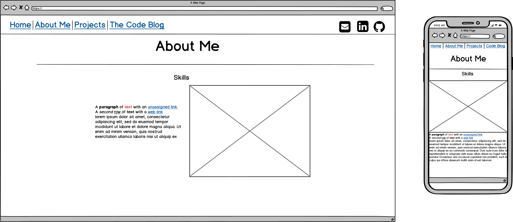
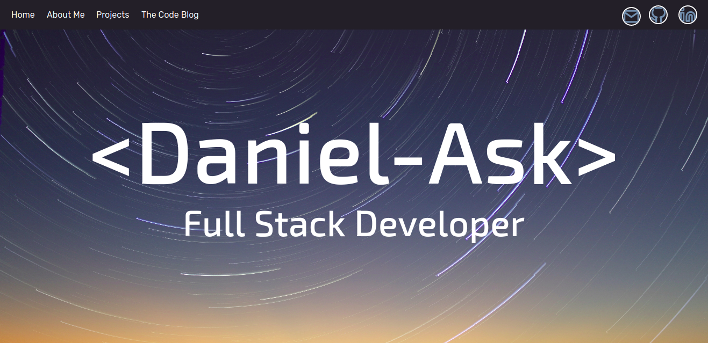

# Portfolio Website

Link to website: dask.netlify.com

Link to Github repository: https://github.com/cDask/portfolio

## Specifications

### Purpose

The purpose of this website is to showcase my HTML and CSS skills as well as provide a platform for recruiters and other developers to learn more about me and projects I've worked on.

## Functionality and Features

The website has a few key features as listed below:

### Four pages

The website has no more than 4 html pages to each hold different aspects of my website. These four pages are:

-   Home 
    - This is the front page of the website which will just holds my name and give the website an stylized front. 
-   About Me
    - This page holds some general information about me such as education, skills and hobbies.
-   Projects
    -   This page holds more information on the developing projects I've completed or been a part in
-   The Code Blog
    -   This is a blog talking about some struggles or thoughts I'm having working on different development projects.

### Mobile Friendly

The website is mobile friendly and should be legible in all devices regardless of screen size. It adapts its content accordingly to make sure nothing is too small or too big to read.

### Navigation

The website has a persistent navigation bar that is present on all pages. It also fixed and will stay on screen as you scroll up and down the page. The navigation bar includes links to all 4 pages, link to my Github account, link to my Linkedin profile and a way to contact me through the website. The navigation bar has been adapted to a pull down menu when on mobile in other to make readability and navigation easier on different devices.

### Interactive

The website has been created in so to make interactions with the website dynamic and easy to follow. This means item that can be clicked will animate so as to give users a better understanding of what is and what is not an Interactive element.

### Accessible

Website has gone through an accessibility audit  using google chrome lighthouse function. This is to test that the website is usable by as many people as possible including people with disabilities.The test is measure out of 100 and the results are displayed below. 

### SRI integrity

The HTML contains an sub resource integrity check. This is to provide some security but checking the integrity of th CSS attached to each html page.

### Branch Variety

If you get the source code from github there are a two branches that provide an alternative experience of the website. These two are:
-   light-mode - I natively built the webpage in a dark theme. Checking out this branch will give you a light theme alternative
-   grid-art - This is an unfinished branch where I use CSS grid to make an image for home page.

## Design

### Mood board

To help conceptualize this project and give me inspiration I used a mood board on Pinterest as seen below. 

The full mood board for this project can be found [here](https://www.pinterest.com.au/dask3/portfolio-website/ "Pinterest Mood Board").

I ended up being quite drawn to space, neon lights and traditional japanese architecture. As I didn't think of wood textures would come out nicely on a web page I decided to use space as my inspiration I passed a space image through this [website](https://artsexperiments.withgoogle.com/artpalette/colors/231f28-475170-718eae-23324c-8d453c "Colour Image Website"). Which gave me the colour scheme I ended up using. The colours ended up a little flatter than expected but still worked well.

For fonts I decided to use quite easy legible fonts all with smooth blocky letter. The way I found them was to use this [website](https://fontjoy.com/ "Font Generator") and some searching on the web.
 
### Wire Frame

After mood boarding I used these wire frames to make an plan for how things are to be layed out on all my pages in both mobile and on desktop.

#### Home Page

#### About Me Page

#### Projects Page

#### Blog Page

### Site Map

Below is the site map of the website.

## End Product

This section covers some information about the final product

### Screen Shots

Here are the final web pages of the website. Below each screenshot I've added a note on how the final product diverged from the original wire frames and design.

#### Home Page

One small thing I changed here from the wire frame is I didn't make the navigation bar transparent. Just found too hard to read against the background and when scrolling over certain images.

The main thing that I changed here from the original design is that I moved all navigation into a drop down menu in order to fit more information without having to squeeze all navigation into a small space. This was repeated on all sites on mobile.

#### About Me Page

Change the layout quite a bit here made it a more card inspired layout. Just kept the top similar to the wire frame. Just felt this was a better way to display the information as there wasn't a lot of text involved.

Only changed the navigation bar here.

#### Projects Page

This page I because there was more text required than I felt looked good in a card format.

Like all other mobile pages I just changed the navigation.

#### Blog Page

Didnt change much here apart from blogs ending up bigger than predicted.

Kept this the same as the wire frame apart from the navigation bar.

### Target Audience

The main target audience for this project is potential employers and recruiters in order for them to get a grasp of my technical skills as well as get to know me a little better. 

### Tech Stack

These are the technologies used in this project

-   HTML for website content and structure
-   CSS and SASS for design
-   Git and Github for version control
-   Netlify to host and deploy my website